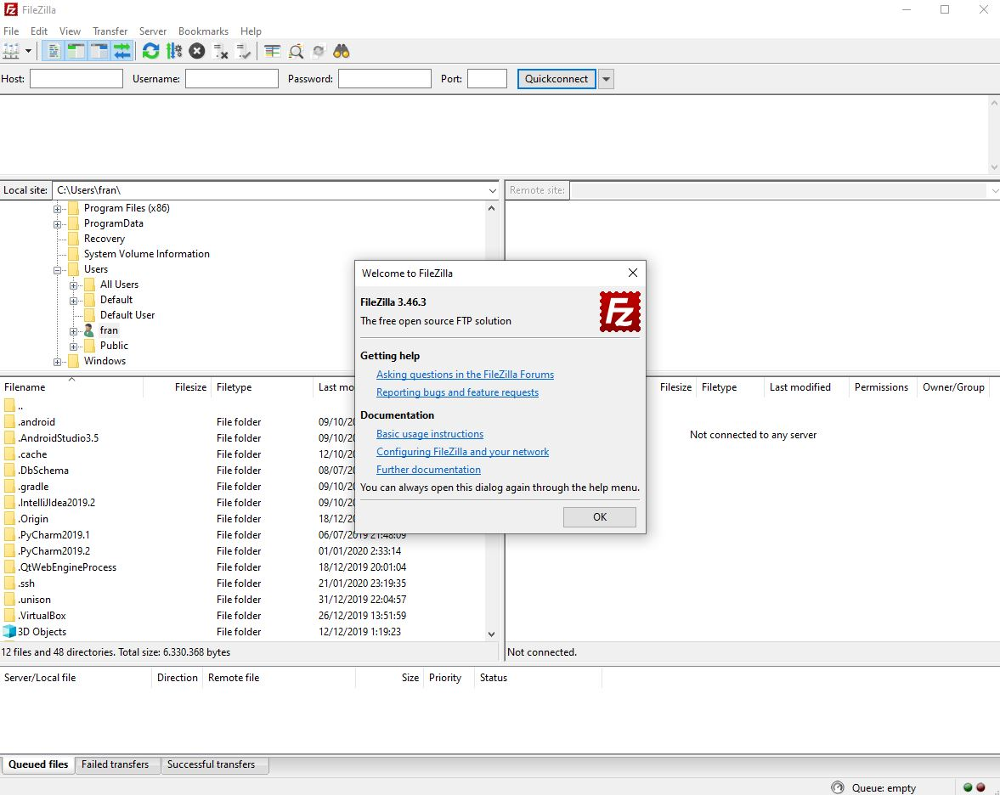
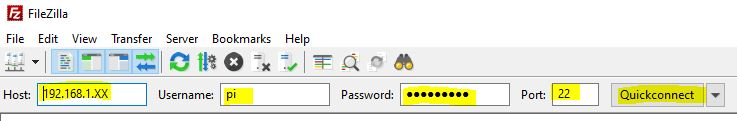
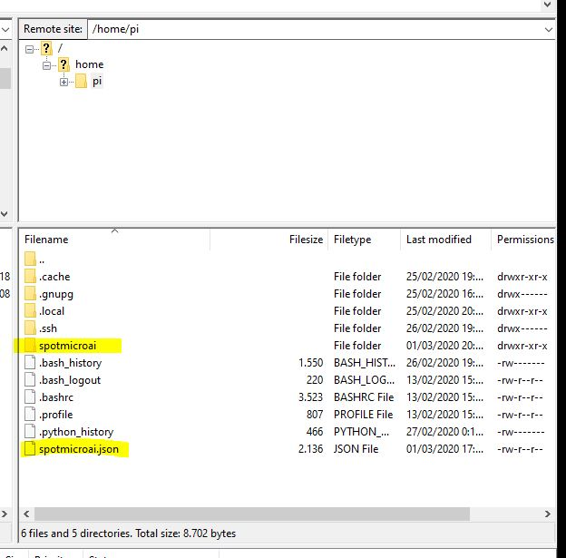

# SpotMicroAI

Hello, I'm Fran and i'm going to guide you in the steps needed for preparing your RaspberryPi to move your SpotMicro.

This part of the tutorial assume you already have the RaspberryPi with a linux service, a simple python that starts when the SpotMicro starts

# Transfering files in and out

We have enabled the SSH service in our SpotMicro, so, we are ready to transfer files to it and from it to our computer conviniently.

To do so we are going to use a software called FileZilla Client, you can download it from: https://filezilla-project.org/download.php?type=client

FileZilla Client installation may suggest you to install third party software, skip it. We just need FileZilla Client.

Open the client to see it, it has 2 sides

* Left side is your local computer
* Right side is your SpotMicro

Write your SpotMicro ip address, user **pi**, password **spotmicro**, port **22** and press QuickConnect!

FileZilla will offer you to save the password, go for it.

You will see the SpotMicro folders in the right panel

Double click in the folder **spotmicro** to see its contents, you can drag and drop files there.

Remember the file spotmicro.py will be run as a service everytime the SpotMicro boots.

# Create a folder and update a file

## Create the spotmicroai folder

* In the right panel, on the folder **/home/pi**, create the folder **spotmicroai**

## Upload a file to the new folder

Now you can drag and drop files from your computer to SpotMicroAI and the reverse conviniently.
Try uploading a file and then deleting it to get familiarized with FileZilla Client.

# SpotMicroAI

**You are all set!**

