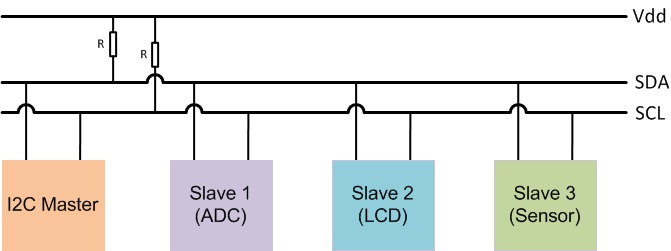
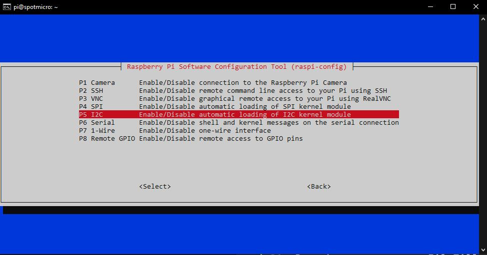
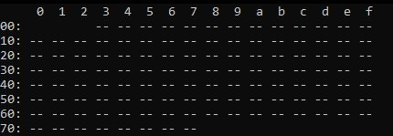
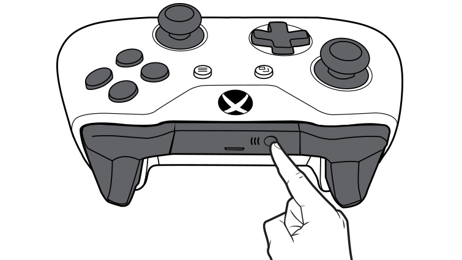
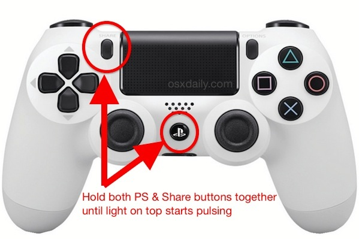
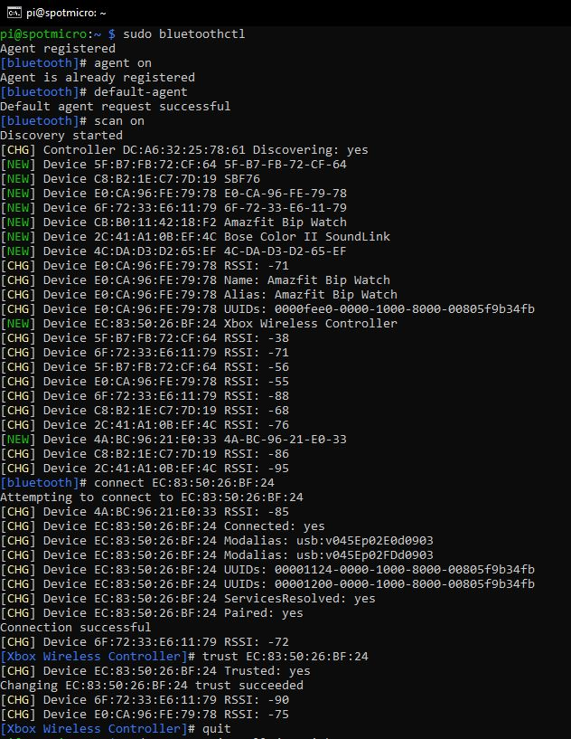
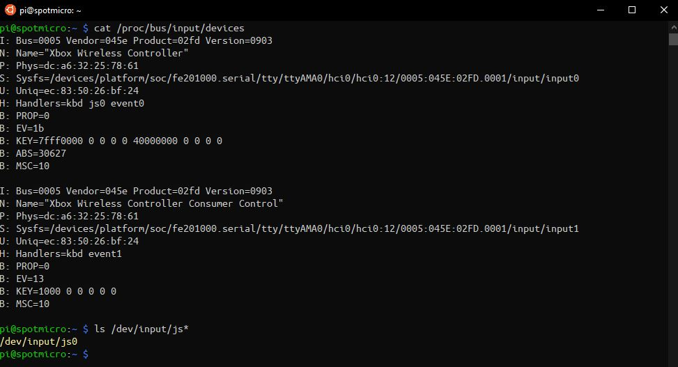
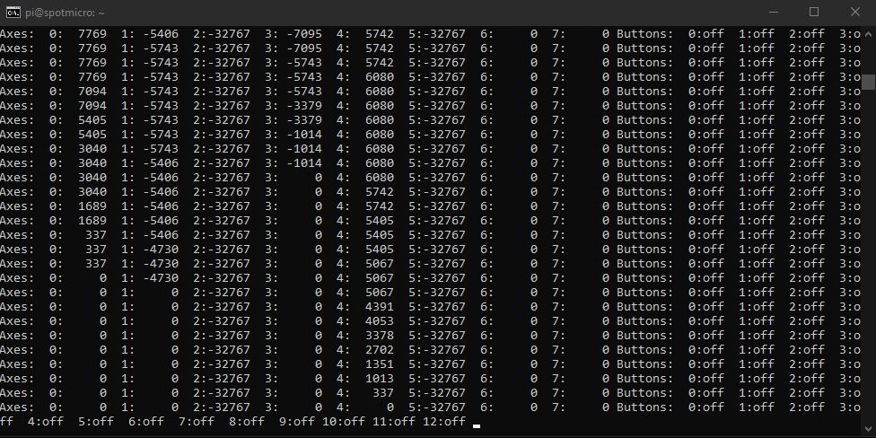

# SpotMicroAI

Hello, I'm Fran and i'm going to guide you in the steps needed to install your SpotMicroAI software.

You need to have the electronic parts wired to finish successfully this manual. Check the [Electronics repository](https://gitlab.com/custom_robots/spotmicroai/electronics) repository if you are not ready yet.

# Video

There is a video to help in this steps: https://youtu.be/nBVdTmTjuQI

# Install the software from the repository

Installation has been automated for simplicity, open a terminal and run the following commands:
```
ssh pi@192.168.1.XX

curl https://gitlab.com/custom_robots/spotmicroai/basic-runtime/-/raw/master/utilities/self_install.sh | bash
cd ~/spotmicroai
git checkout ba031e5fad88fbcd751b23df0d87d6e76496068c
```

# Enable I2C

I2C is a communication bus that let us connect in serial (daisy connection) many devices.

RaspberryPI has I2C bus capabilities and it also has the needed pull up resistors build in, so we just need to connect to it the devices.



Every connected device must have a different I2C address, usually if you have 2 of the very same board you need to sold a pin or reconfigure a jumper to change in one of them its I2C hardware address.

Open a terminal and run the following commands
```
ssh pi@192.168.1.XX
sudo raspi-config
```

And from the options presented, do the following changes:

* Interfacing options
  * Enable I2C



* Select Finish and if requested, accept the reboot option

## List all I2C devices connected

Use the following command when you have any device connected to I2C to know its address. We will need the address in our Python script later to use it.

```
ssh pi@192.168.1.XX
i2cdetect -y 1
```

Will be empty for now:




# Remote controllers

You can use XBOX One controller or PS4 controller (or basically any bluetooth controller)

## XBox One controller

To wake up the controller press the big central button.

To force the controller to go to sleep, hold the big central button for 10 seconds. Once the light turns off, the controller is asleep.

XBox one controller supports bluetooth, to put your XBOX One controller in bluetooth in paring mode you must enable it with the big XBox One button and then, in the front, press the share button a few seconds till the light blinking pace changes.



## PS4 controller

To wake up the controller press the PS button.

To force the controller to go to sleep, hold the PS button for 10 seconds. Once the light bar turns off, the controller is asleep.

PS4 controller supports bluetooth, to put your PS4 controller in bluetooth in paring mode press and hold the Share button then the PS button.

After a few seconds, the light bar will strobe rapidly and brightly.

The controller is now in pairing mode.



## Pair the controller with the Raspberry Pi

Connect to your Raspberry Pi

```
ssh pi@192.168.1.XX

sudo bluetoothctl
```

The terminal prompt will change, no worries, just write:

```
agent on
default-agent
scan on
```

Some bluetooth addresses will start poping up, the one you are looking is called something like the following:

* [NEW] Device XX:XX:XX:XX:XX:XX Wireless Controller

Write down your mac address and while the controller is in pair mode just connect to it:

```
connect XX:XX:XX:XX:XX:XX
```

You will see that there is an attempt to connect and finally it gets paired.

Next step is to make the RaspberryPi to remember that controller, so everytime you switch it on, will connect to it automatically:

```
trust XX:XX:XX:XX:XX:XX
```

Basically the whole process will be similar to the one in the picture:



## Testing the controller

We need now to test than the controller is properly working!

Check if is present with the following commands:

```
cat /proc/bus/input/devices
ls /dev/input/js*
```



Lets test the buttons and axis, with the following command you will see a screen with a bunch of numbers, those are the axis and buttons of the controler, press them to see how they are detected.

```
sudo jstest /dev/input/js0
```



Done!


