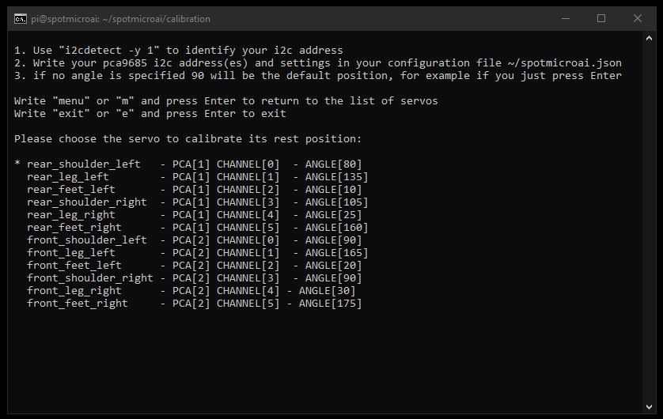

# SpotMicroAI

Hello, I'm Fran and i'm going to guide you in the steps needed to make your SpotMicroAI software autobootable.

We will cover too the configuration file that belongs to your SpotMicroAI, the place where you map the I2C address and your servos.

# Run the software automatically on boot

Just enable it using the following script:

```
ssh pi@192.168.1.XX

cd ~/spotmicroai/systemd/
./enable_spotmicroai_on_boot.sh
```

Note you also have the "disable_spotmicroai_on_boot.sh" script to disable the auto-boot

## AutoUpdate

Check at the run script located at: https://gitlab.com/custom_robots/spotmicroai/basic-runtime/-/blob/master/run_spotmicroai.sh

Notice SpotMicroAI will always update its sofware on every boot if wifi is available.

This will not wipe out your configuration file, just the OS will have the latest updates.

## Check the logs

You can check the logs with the daemon.log if you enabled autoboot or the log folder in spotmicroai

```
tail -f /var/log/daemon.log
```
or
```
tail -f ~/spotmicroai/logs/SpotMicroAI.log
```

# Configuration file

Is time for you to setup your mappings and i2c address. Edit the file **~/spotmicroai.json** to do so.

You can use FileZilla and do it locally or nano editor.

```
ssh pi@192.168.1.XX

nano ~/spotmicroai.json
```

The default config file will be generated from the source: https://gitlab.com/custom_robots/spotmicroai/basic-runtime/-/blob/master/spotmicroai.default, which assume you have 2 PCA9685 boards, 1 LCD 16x2 I2C screen and the GPIO 17 port mapped to the 0E port in the PCA9685 boards as explained in the Electronics repository at https://gitlab.com/custom_robots/spotmicroai/electronics

For security, all your rest_angle values for the servos are set up at 90º in the default configuration

## TIP

You can use "i2cdetect -y 1" tool to identify your i2c addresses


# Calibration

The calibration tool will help you to find the sweet spot, you can navigate there your config file and test each servo to get to the final calibration.

```
ssh pi@192.168.1.XX

cd ~/spotmicroai/calibration

./calibration.sh
```




TODO: Missing a picture of the "rest position of the dog"

# When you are ready!

* Activate your spot
* Activate your remote controller
* Press Start (XBOX controller) u Options (PS4 remote controller) to power up your servos
* Pres the buttons!

