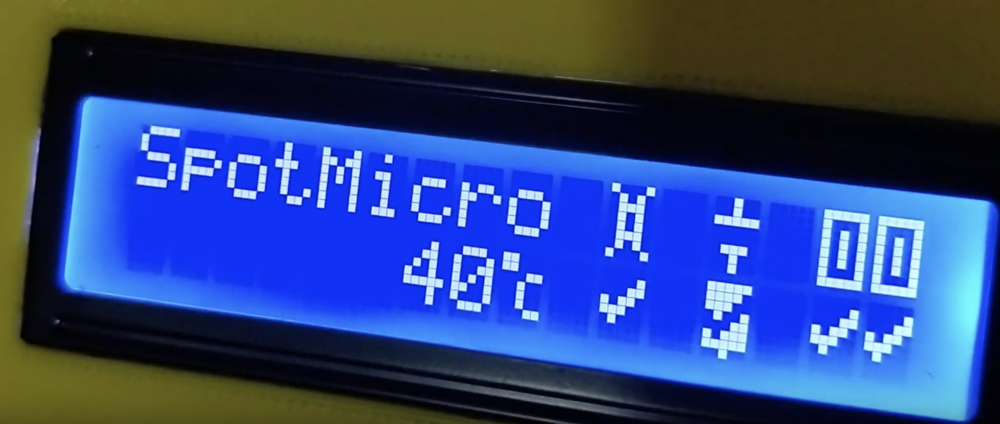

# SpotMicroAI

Hello, I'm Fran and i'm going to explain what the screen is saying when you boot SpotMicroAI.

# The screen and its icons

## Icons and text

### SpotMicro

Is just a text

### Temperature

The Raspberry Pi CPU temperature, beyond 50º you need to use a heat sink. RaspberryPi 4 runs very hot by default

### Remote controller

* OK

* NO OK

* SEARCHING

### Abort controller (GPIO17 to 0E)

Cuts the power to the servos

* OK

* NO OK

* ACTIVE

This will show when you press start/options button in your controller

### Motion controller

2 icons, each one represents 1 PCA9685, some people use 2 boards, others use only 1

* OK

* NOK

* NOT PRESENT

